# Applied Statistics Final Project - YOLO Networks in Action

## Introduction and Project Outline

In this project we will be exploring the process of retraining the some of the most popular state of the art computer vision models out there - more specifically, 
multiple samples from the YOLO (You Only Look Once) family of architectures.  
  
The YOLO series relies on several generations / implementations of different architectures to achieve object / bounding box detections on classes which they were trained on. YOLO was originally made
for real time applications, however for the scope of our project we will focus strictly on single frame performance and testing. We have included a snippet of output from running inference of a YOLOv8m
model we retrained as to provide an example of what the model is capable of doing. In this specific example the model found one plane with a confidence of 90%.

*its important to mention that when we retrain the model, if we dont provide examples of all of the other classes the model (pretrained weights) was already trained on, then the model will "forget" it. So essentially what we are doing here is replacing the classes the model was already trained on with our own ones.*

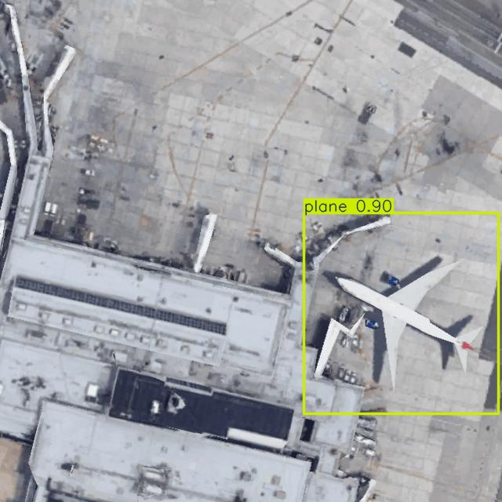  
  
### Now for the outline of our project  
In our case specifically we will be retraining 4 variants of YOLO on the same dataset to examine each model's respective performance and characteristics. The motivation for this project
is to exemplify how one might implement these models for their specific needs in the real world - for example an intelligence agency whos job it is to examine satellite photos, which can use YOLO
in order to sweep though a large amount of photos hastily while being able to retrain the model on new targets that they might need to identify (a new type of plane, a dock / harbour or anything else for that matter).  
  
The variants of YOLO that we will be retraining are:  

- YOLOv5n
- YOLOv5m
- YOLOv8n
- YOLOv8m

### What are the differences between these variants?  
  
**As a general rule of thumb** YOLO models come in multiple *sizes* - N, S, M, L, X. The meanings of each can be summarised using the following table:  
  
  | Model        | Size       | Speed         | Accuracy       |
|--------------|------------|---------------|----------------|
| **YOLO-N**   | Very Small | Fastest       | Lowest Accuracy|
| **YOLO-S**   | Small      | Very Fast     | Lower Accuracy |
| **YOLO-M**   | Medium     | Balanced      | Medium Accuracy|
| **YOLO-L**   | Large      | Slower        | High Accuracy  |
| **YOLO-X**   | Extra Large| Slowest       | Highest Accuracy|
  
### There are architectural differences between YOLOv5 and YOLOv8  
The main differences between YOLOv5 and YOLOv8 boil down to the use of a concept called an "anchor box".

**Anchor Box (Simplified Definition)**
  
*An anchor box is a predefined bounding box of specific size and shape placed on a feature map grid cell. It serves as a reference for the model to predict the final object bounding box by adjusting its position, size, and shape.*

| **Aspect**             | **Anchor-Based Detection** (YOLOv5)         | **Anchor-Free Detection** (YOLOv8)          |
|------------------------|-------------------------------------|------------------------------------|
| **Bounding Box**       | Predicted as offsets to predefined anchor boxes. | Directly predicts the bounding box center, size, and coordinates. |
| **Anchors**            | Uses predefined anchor boxes at each grid cell. | Does not use anchor boxes.         |
| **Scalability**        | Requires manually tuning anchor sizes and aspect ratios. | Simpler and less manual design.    |
| **Computation**        | Slightly more complex due to anchor generation. | Faster and more efficient.         |
| **Flexibility**        | Works well for objects of different scales/aspect ratios. | Better for detecting small and irregular objects. |


## Below is a summary of the architectures of the YOLO variants we selected to examine:  

<div style="display: flex; gap: 20px;">

<div>

### YOLOv5n
<details>
    <summary> 🏗️ Click to view model architecture</summary>

| **Index** | **From** | **#** | **Params** | **Module**                              | **Arguments**                  |
|-----------|----------|-------|------------|----------------------------------------|--------------------------------|
| 0         | -1       | 1     | 1,760      | ultralytics.nn.modules.conv.Conv       | [3, 16, 6, 2, 2]               |
| 1         | -1       | 1     | 4,672      | ultralytics.nn.modules.conv.Conv       | [16, 32, 3, 2]                 |
| 2         | -1       | 1     | 4,800      | ultralytics.nn.modules.block.C3        | [32, 32, 1]                    |
| 3         | -1       | 1     | 18,560     | ultralytics.nn.modules.conv.Conv       | [32, 64, 3, 2]                 |
| 4         | -1       | 2     | 29,184     | ultralytics.nn.modules.block.C3        | [64, 64, 2]                    |
| 5         | -1       | 1     | 73,984     | ultralytics.nn.modules.conv.Conv       | [64, 128, 3, 2]                |
| 6         | -1       | 3     | 156,928    | ultralytics.nn.modules.block.C3        | [128, 128, 3]                  |
| 7         | -1       | 1     | 295,424    | ultralytics.nn.modules.conv.Conv       | [128, 256, 3, 2]               |
| 8         | -1       | 1     | 296,448    | ultralytics.nn.modules.block.C3        | [256, 256, 1]                  |
| 9         | -1       | 1     | 164,608    | ultralytics.nn.modules.block.SPPF      | [256, 256, 5]                  |
| 10        | -1       | 1     | 33,024     | ultralytics.nn.modules.conv.Conv       | [256, 128, 1, 1]               |
| 11        | -1       | 1     | 0          | torch.nn.modules.upsampling.Upsample   | [None, 2, 'nearest']           |
| 12        | [-1, 6]  | 1     | 0          | ultralytics.nn.modules.conv.Concat     | [1]                            |
| 13        | -1       | 1     | 90,880     | ultralytics.nn.modules.block.C3        | [256, 128, 1, False]           |
| 14        | -1       | 1     | 8,320      | ultralytics.nn.modules.conv.Conv       | [128, 64, 1, 1]                |
| 15        | -1       | 1     | 0          | torch.nn.modules.upsampling.Upsample   | [None, 2, 'nearest']           |
| 16        | [-1, 4]  | 1     | 0          | ultralytics.nn.modules.conv.Concat     | [1]                            |
| 17        | -1       | 1     | 22,912     | ultralytics.nn.modules.block.C3        | [128, 64, 1, False]            |
| 18        | -1       | 1     | 36,992     | ultralytics.nn.modules.conv.Conv       | [64, 64, 3, 2]                 |
| 19        | [-1, 14] | 1     | 0          | ultralytics.nn.modules.conv.Concat     | [1]                            |
| 20        | -1       | 1     | 74,496     | ultralytics.nn.modules.block.C3        | [128, 128, 1, False]           |
| 21        | -1       | 1     | 147,712    | ultralytics.nn.modules.conv.Conv       | [128, 128, 3, 2]               |
| 22        | [-1, 10] | 1     | 0          | ultralytics.nn.modules.conv.Concat     | [1]                            |
| 23        | -1       | 1     | 296,448    | ultralytics.nn.modules.block.C3        | [256, 256, 1, False]           |
| 24        | [17, 20, 23] | 1 | 754,237    | ultralytics.nn.modules.head.Detect     | [15, [64, 128, 256]]           |
</details>

### Key Points:

- **Total Layers**: 262  
- **Total Trainable Parameters**: 2.51M  

</div>

<div>

### YOLOv5m

<details>
    <summary> 🏗️ Click to view model architecture</summary>

| **Index** | **From**         | **n** | **Params**  | **Module**                                  | **Arguments**                      |
|-----------|------------------|-------|-------------|--------------------------------------------|-----------------------------------|
| 0         | -1               | 1     | 5280        | ultralytics.nn.modules.conv.Conv            | [3, 48, 6, 2, 2]                  |
| 1         | -1               | 1     | 41664       | ultralytics.nn.modules.conv.Conv            | [48, 96, 3, 2]                    |
| 2         | -1               | 2     | 65280       | ultralytics.nn.modules.block.C3             | [96, 96, 2]                       |
| 3         | -1               | 1     | 166272      | ultralytics.nn.modules.conv.Conv            | [96, 192, 3, 2]                   |
| 4         | -1               | 4     | 444672      | ultralytics.nn.modules.block.C3             | [192, 192, 4]                     |
| 5         | -1               | 1     | 664320      | ultralytics.nn.modules.conv.Conv            | [192, 384, 3, 2]                  |
| 6         | -1               | 6     | 2512896     | ultralytics.nn.modules.block.C3             | [384, 384, 6]                     |
| 7         | -1               | 1     | 2655744     | ultralytics.nn.modules.conv.Conv            | [384, 768, 3, 2]                  |
| 8         | -1               | 2     | 4134912     | ultralytics.nn.modules.block.C3             | [768, 768, 2]                     |
| 9         | -1               | 1     | 1476864     | ultralytics.nn.modules.block.SPPF           | [768, 768, 5]                     |
| 10        | -1               | 1     | 295680      | ultralytics.nn.modules.conv.Conv            | [768, 384, 1, 1]                  |
| 11        | -1               | 1     | 0           | torch.nn.modules.upsampling.Upsample        | [None, 2, 'nearest']              |
| 12        | [-1, 6]          | 1     | 0           | ultralytics.nn.modules.conv.Concat          | [1]                               |
| 13        | -1               | 2     | 1182720     | ultralytics.nn.modules.block.C3             | [768, 384, 2, False]              |
| 14        | -1               | 1     | 74112       | ultralytics.nn.modules.conv.Conv            | [384, 192, 1, 1]                  |
| 15        | -1               | 1     | 0           | torch.nn.modules.upsampling.Upsample        | [None, 2, 'nearest']              |
| 16        | [-1, 4]          | 1     | 0           | ultralytics.nn.modules.conv.Concat          | [1]                               |
| 17        | -1               | 2     | 296448      | ultralytics.nn.modules.block.C3             | [384, 192, 2, False]              |
| 18        | -1               | 1     | 332160      | ultralytics.nn.modules.conv.Conv            | [192, 192, 3, 2]                  |
| 19        | [-1, 14]         | 1     | 0           | ultralytics.nn.modules.conv.Concat          | [1]                               |
| 20        | -1               | 2     | 1035264     | ultralytics.nn.modules.block.C3             | [384, 384, 2, False]              |
| 21        | -1               | 1     | 1327872     | ultralytics.nn.modules.conv.Conv            | [384, 384, 3, 2]                  |
| 22        | [-1, 10]         | 1     | 0           | ultralytics.nn.modules.conv.Concat          | [1]                               |
| 23        | -1               | 2     | 4134912     | ultralytics.nn.modules.block.C3             | [768, 768, 2, False]              |
| 24        | [17, 20, 23]     | 1     | 4226749     | ultralytics.nn.modules.head.Detect          | [15, [192, 384, 768]]             |
</details>

### Key Points:

- **Total Layers**: 339  
- **Total Trainable Parameters**: 25.07M  

</div>

</div>

  
<div style="display: flex; gap: 20px;">

<div>

### YOLOv8n
<details>
    <summary> 🏗️ Click to view model architecture</summary>
    
| **Index** | **From**    | **N** | **Parameters** | **Module**                                     | **Arguments**              |
|-----------|-------------|-------|----------------|-----------------------------------------------|----------------------------|
| 0         | -1          | 1     | 464            | ultralytics.nn.modules.conv.Conv               | [3, 16, 3, 2]              |
| 1         | -1          | 1     | 4672           | ultralytics.nn.modules.conv.Conv               | [16, 32, 3, 2]             |
| 2         | -1          | 1     | 7360           | ultralytics.nn.modules.block.C2f               | [32, 32, 1, True]          |
| 3         | -1          | 1     | 18560          | ultralytics.nn.modules.conv.Conv               | [32, 64, 3, 2]             |
| 4         | -1          | 2     | 49664          | ultralytics.nn.modules.block.C2f               | [64, 64, 2, True]          |
| 5         | -1          | 1     | 73984          | ultralytics.nn.modules.conv.Conv               | [64, 128, 3, 2]            |
| 6         | -1          | 2     | 197632         | ultralytics.nn.modules.block.C2f               | [128, 128, 2, True]        |
| 7         | -1          | 1     | 295424         | ultralytics.nn.modules.conv.Conv               | [128, 256, 3, 2]           |
| 8         | -1          | 1     | 460288         | ultralytics.nn.modules.block.C2f               | [256, 256, 1, True]        |
| 9         | -1          | 1     | 164608         | ultralytics.nn.modules.block.SPPF              | [256, 256, 5]              |
| 10        | -1          | 1     | 0              | torch.nn.modules.upsampling.Upsample           | [None, 2, 'nearest']       |
| 11        | [-1, 6]     | 1     | 0              | ultralytics.nn.modules.conv.Concat             | [1]                        |
| 12        | -1          | 1     | 148224         | ultralytics.nn.modules.block.C2f               | [384, 128, 1]              |
| 13        | -1          | 1     | 0              | torch.nn.modules.upsampling.Upsample           | [None, 2, 'nearest']       |
| 14        | [-1, 4]     | 1     | 0              | ultralytics.nn.modules.conv.Concat             | [1]                        |
| 15        | -1          | 1     | 37248          | ultralytics.nn.modules.block.C2f               | [192, 64, 1]               |
| 16        | -1          | 1     | 36992          | ultralytics.nn.modules.conv.Conv               | [64, 64, 3, 2]             |
| 17        | [-1, 12]    | 1     | 0              | ultralytics.nn.modules.conv.Concat             | [1]                        |
| 18        | -1          | 1     | 123648         | ultralytics.nn.modules.block.C2f               | [192, 128, 1]              |
| 19        | -1          | 1     | 147712         | ultralytics.nn.modules.conv.Conv               | [128, 128, 3, 2]           |
| 20        | [-1, 9]     | 1     | 0              | ultralytics.nn.modules.conv.Concat             | [1]                        |
| 21        | -1          | 1     | 493056         | ultralytics.nn.modules.block.C2f               | [384, 256, 1]              |
| 22        | [15, 18, 21]| 1     | 754237         | ultralytics.nn.modules.head.Detect             | [15, [64, 128, 256]]       |

</details>

### Key Points:

- **Total Layers:** 225  
- **Total Trainable Parameters:** 3.01M  
 

</div>

<div>

### YOLOv8m

<details>
    <summary> 🏗️ Click to view model architecture</summary>

| **Index** | **From** | **Number** | **Parameters** | **Module**                                              | **Arguments**                          |
|-----------|----------|------------|----------------|--------------------------------------------------------|----------------------------------------|
| 0         | -1       | 1          | 1392           | `ultralytics.nn.modules.conv.Conv`                     | [3, 48, 3, 2]                          |
| 1         | -1       | 1          | 41664          | `ultralytics.nn.modules.conv.Conv`                     | [48, 96, 3, 2]                         |
| 2         | -1       | 2          | 111360         | `ultralytics.nn.modules.block.C2f`                     | [96, 96, 2, True]                      |
| 3         | -1       | 1          | 166272         | `ultralytics.nn.modules.conv.Conv`                     | [96, 192, 3, 2]                        |
| 4         | -1       | 4          | 813312         | `ultralytics.nn.modules.block.C2f`                     | [192, 192, 4, True]                    |
| 5         | -1       | 1          | 664320         | `ultralytics.nn.modules.conv.Conv`                     | [192, 384, 3, 2]                       |
| 6         | -1       | 4          | 3248640        | `ultralytics.nn.modules.block.C2f`                     | [384, 384, 4, True]                    |
| 7         | -1       | 1          | 1991808        | `ultralytics.nn.modules.conv.Conv`                     | [384, 576, 3, 2]                       |
| 8         | -1       | 2          | 3985920        | `ultralytics.nn.modules.block.C2f`                     | [576, 576, 2, True]                    |
| 9         | -1       | 1          | 831168         | `ultralytics.nn.modules.block.SPPF`                    | [576, 576, 5]                          |
| 10        | -1       | 1          | 0              | `torch.nn.modules.upsampling.Upsample`                 | [None, 2, 'nearest']                   |
| 11        | [-1, 6]  | 1          | 0              | `ultralytics.nn.modules.conv.Concat`                   | [1]                                    |
| 12        | -1       | 2          | 1993728        | `ultralytics.nn.modules.block.C2f`                     | [960, 384, 2]                          |
| 13        | -1       | 1          | 0              | `torch.nn.modules.upsampling.Upsample`                 | [None, 2, 'nearest']                   |
| 14        | [-1, 4]  | 1          | 0              | `ultralytics.nn.modules.conv.Concat`                   | [1]                                    |
| 15        | -1       | 2          | 517632         | `ultralytics.nn.modules.block.C2f`                     | [576, 192, 2]                          |
| 16        | -1       | 1          | 332160         | `ultralytics.nn.modules.conv.Conv`                     | [192, 192, 3, 2]                       |
| 17        | [-1, 12] | 1          | 0              | `ultralytics.nn.modules.conv.Concat`                   | [1]                                    |
| 18        | -1       | 2          | 1846272        | `ultralytics.nn.modules.block.C2f`                     | [576, 384, 2]                          |
| 19        | -1       | 1          | 1327872        | `ultralytics.nn.modules.conv.Conv`                     | [384, 384, 3, 2]                       |
| 20        | [-1, 9]  | 1          | 0              | `ultralytics.nn.modules.conv.Concat`                   | [1]                                    |
| 21        | -1       | 2          | 4207104        | `ultralytics.nn.modules.block.C2f`                     | [960, 576, 2]                          |
| 22        | [15, 18, 21] | 1       | 3784381        | `ultralytics.nn.modules.head.Detect`                   | [15, [192, 384, 576]]                  |


</details>

### Key Points:

- **Total Layers**: 295  
- **Total Trainable Parameters**: 25.9M  
 

</div>

</div>


  
  
From the architectural & technical summaries above we can see that there are major differences between the genereations and variants of the models. As such we decided to take samples
from two of the most popular gnerations of YOLO (v5 and v8) as well as two of the lighter variants (N and M) while placing an emphasis that we take at least some spacing between the variants
as to avoid sampling ones which might be too close to see dramatic results (such as N and S).

We would also like to re-iterate that we were working under time and hardware constraints. Specifically when it comes to hardware all of the training that took place was done with a 
Laptop RTX-4070 with 8GB of VRAM.

## Data Preparation
  

To retrain our selected YOLO models we made use of the klk dataset which we found on roboflow.  
The dataset can be found [here](https://universe.roboflow.com/kemal/klk-pwt7h).  
As a summary the dataset structure looks like:  

- Dataset
    - train
        - images
        - labels
    - valid
        - images
        - labels
    - data.yaml  

  
Where the images / labels pairs are simply an image with coordinates to a bounding box and a respective class of object within that bounding box.  
The classes that are included in the dataset (we decided to train on all 15 of them) are:  

- baseball-diamond
- basketball-court
- bridge
- ground-track-field
- harbor
- helicopter
- large-vehicle
- plane
- roundabout
- ship
- small-vehicle
- soccer-ball-field
- storage-tank
- swimming-pool
- tennis-court  

# Dataset Metrics - Training 70% / Validation 30%  
  
Data preparation and metrics notebook can be found [here](data_prep_and_statistics.ipynb).


## Training (4693 images)

<details>
    <summary> 📊 Click to view graphs</summary>

### Label distribution (Train) - Frequency of each label
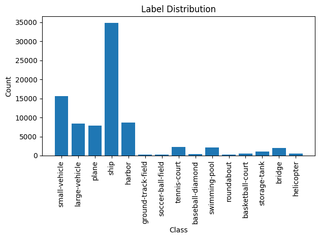  

### Class frequency (Train) - Amount of images that display 
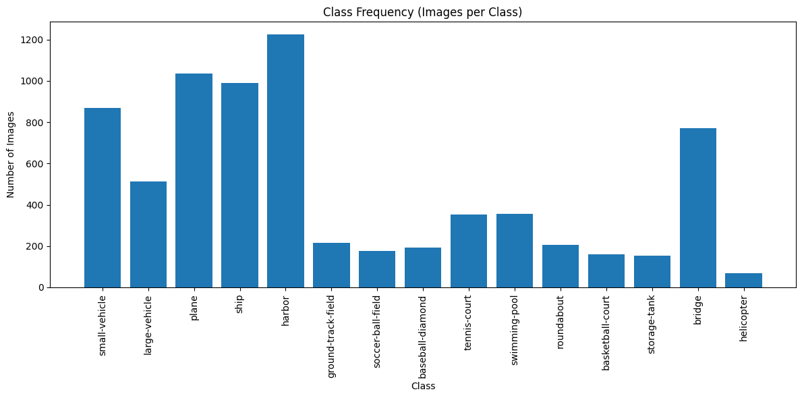  

### Class co-occurence (Train)
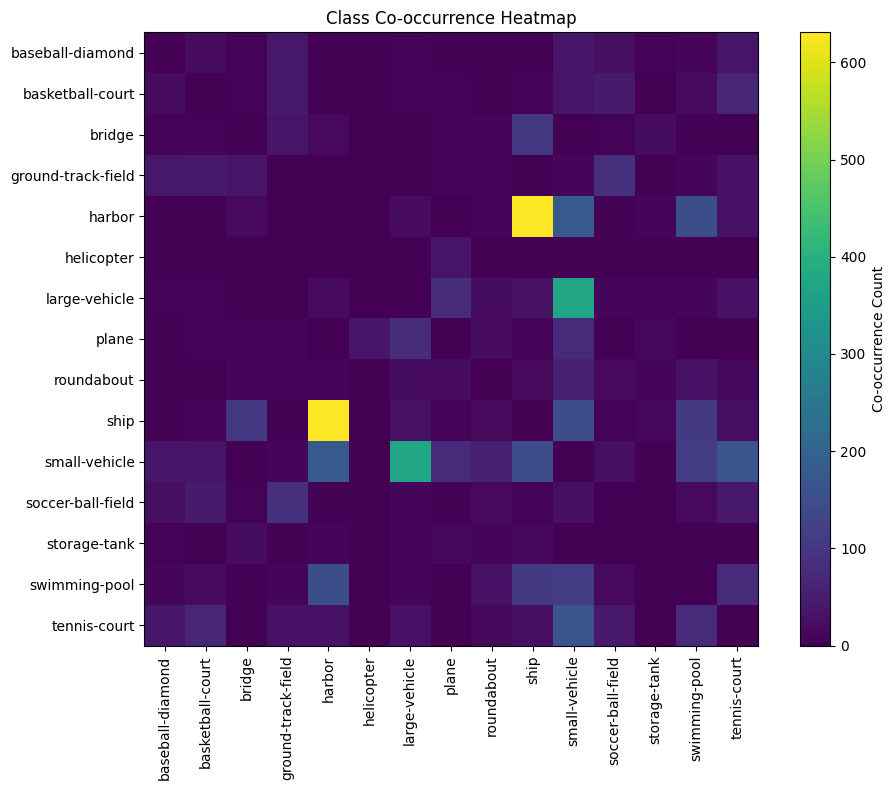  

### Bounding Box size Distribution (Train)
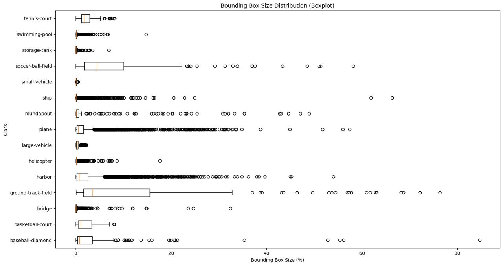  

</details>

## Validation (2011 images)

<details>
    <summary> 📊 Click to view graphs</summary>

### Label distribution (Validation) - Frequency of each label
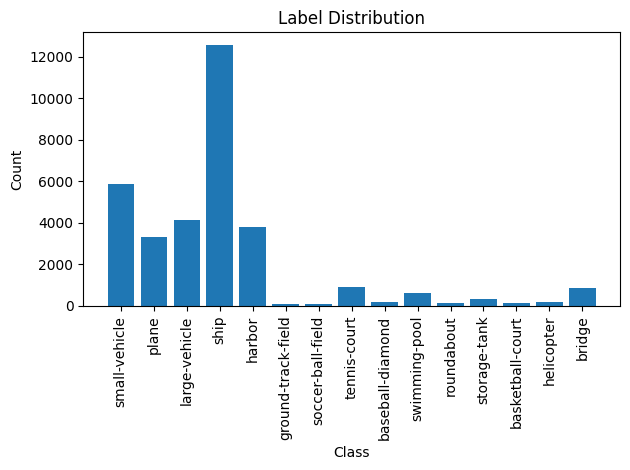  

### Class frequency (Validation) - Amount of images that display 
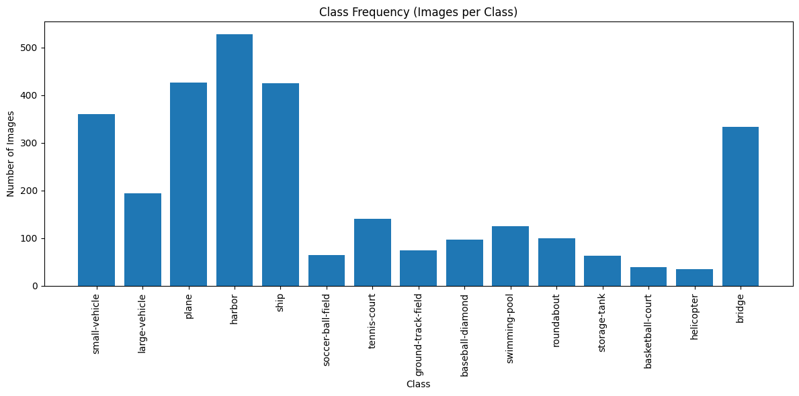  

### Class co-occurence (Validation)
  

</details>

# Training Summary  

Now we have reached the model traning phase where we are to train the models we selected on our dataset of choice. Luckily for us, we wont have to write the model from scratch as ultralytics
provides an elegant suite for us to use if we wish to retrain their YOLO models.  
To get started we simply run these commands:  
```bash
pip install ultralytics
```  
And then run:  
```bash
yolo task=detect mode=train model=yolov<5/8 (your preference)><n/m (your preference)>.pt data=data.yaml epochs=50 imgsz=640 batch=8
```  
**Note** We chose these specific paramenters since:  
- It was recommended by multiple sources to retrain any version of YOLO on at least 50 epochs
- YOLO works best on 640x640 images
- Batch size greater than 8 took up too much VRAM for our hardware (RTX 4070 Laptop) and would crash the training  

**Another note:** In the model evaluation the term DFL loss will come up quite frequently. To save having to dig through definitions we provided one here:
**DFL Loss (Distribution Focal Loss):**
*DFL Loss reflects how far off the predicted probability distribution of bounding box locations is from the target distribution (ground truth).*
*It measures the difference between the predicted coordinates (represented as a probability distribution) and the true position of an object in the image.*


## YOLOv5n Training Results

<details>
    <summary>📈 Click to see results</summary>

---

## YOLOv5n Final Metrics Summary (Epoch 50)
| Metric               | Value      |
|----------------------|------------|
| **Epoch**            | 50         |
| **Train Box Loss**   | 1.6068     |
| **Train Class Loss** | 1.5051     |
| **Train DFL Loss**   | 1.1508     |
| **Validation Box Loss** | 1.6220  |
| **Validation Class Loss** | 1.6558 |
| **Validation DFL Loss** | 1.1947  |
| **Precision**        | 0.78842    |
| **Recall**           | 0.67590    |
| **mAP@0.5**          | 0.73218    |
| **mAP@0.5:0.95**     | 0.49329    |

---

## Training Loss Over Epochs
### YOLOv5n Training Loss Plot
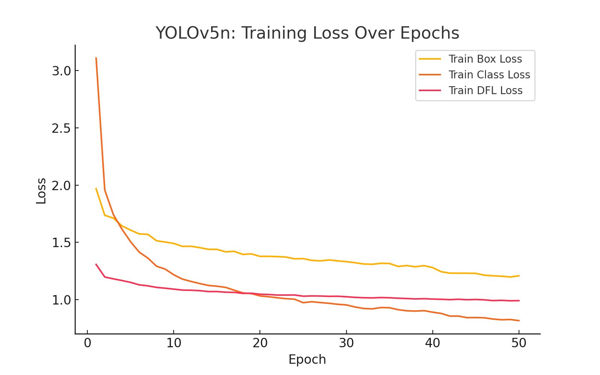  

**Explanation:**
- The **Box Loss**, **Class Loss**, and **DFL Loss** decrease steadily over epochs, indicating effective training.

---

## Validation Loss Over Epochs
### YOLOv5n Validation Loss Plot

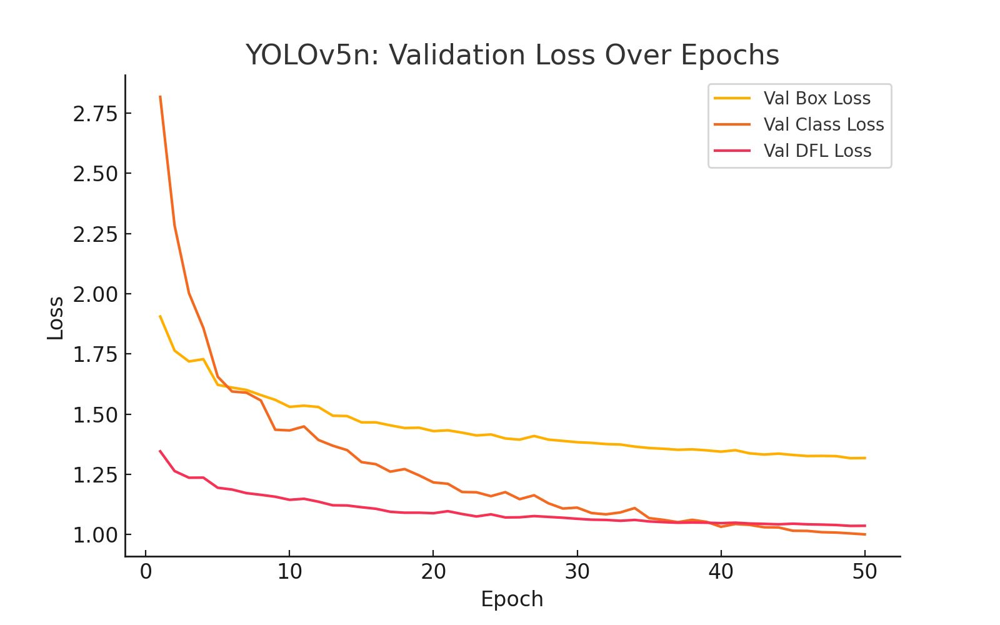 

**Explanation:**
- Validation losses stabilize at higher values, suggesting that the model has lower generalization performance compared to larger versions like YOLOv5m.

---

## Validation Metrics Over Epochs
### YOLOv5n Validation Metrics Plot
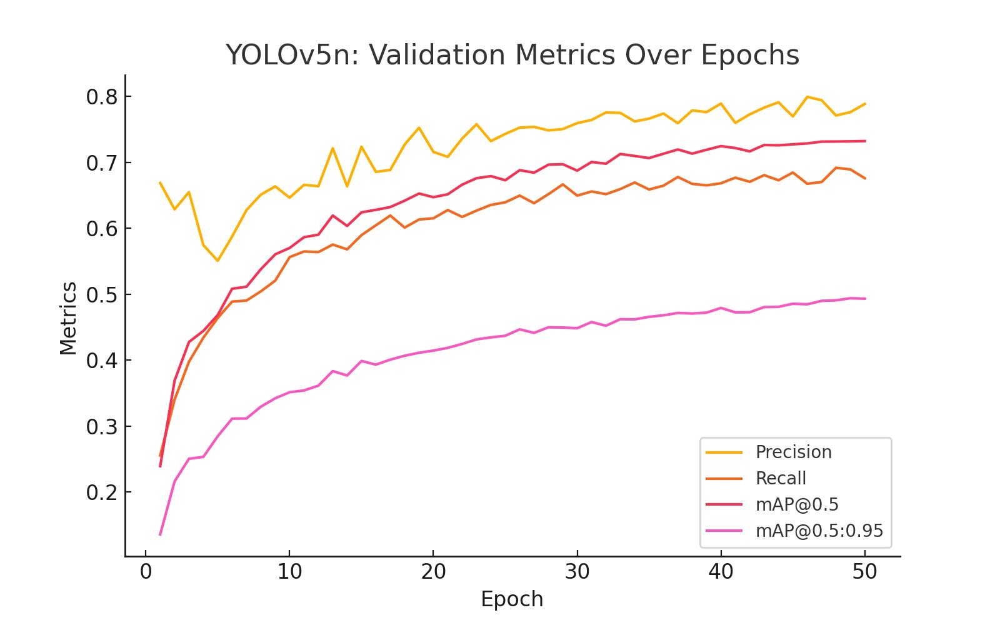 

**Explanation:**
- Precision, Recall, and mAP values improve over epochs but remain lower than those of larger models.

---
</details>


## YOLOv5m Training Results

<details>
    <summary>📈 Click to see results</summary>


---

## Final Metrics Summary (Epoch 50)
| Metric             | Value      |
|--------------------|------------|
| **Epoch**          | 50         |
| **Train Box Loss** | 0.92823    |
| **Train Class Loss** | 0.5212   |
| **Train DFL Loss** | 0.92048    |
| **Validation Box Loss** | 1.116 |
| **Validation Class Loss** | 0.69903 |
| **Validation DFL Loss** | 0.99964 |
| **Precision**      | 0.84976    |
| **Recall**         | 0.78668    |
| **mAP@0.5**        | 0.83693    |
| **mAP@0.5:0.95**   | 0.59779    |

---

## Training Loss Over Epochs
- **Box Loss**, **Class Loss**, and **DFL Loss** decrease consistently over time, showing effective convergence during training.

### Training Loss Plot
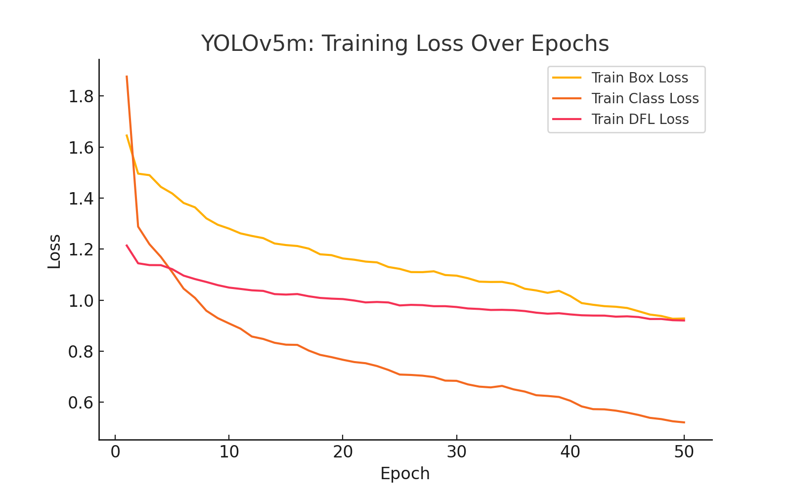 

**Explanation:**
- The training loss measures how well the model learns during training.
- **Box Loss**: Measures the error in predicting the bounding box locations.
- **Class Loss**: Measures the error in classifying the detected objects.
- **DFL Loss**: Refers to the distribution focal loss, which optimizes localization precision.
- The consistent decrease in these losses indicates that the model is learning effectively over the epochs.

---

## Validation Loss Over Epochs
- Validation losses for box, class, and DFL decrease similarly, reflecting good generalization to unseen data.

### Validation Loss Plot
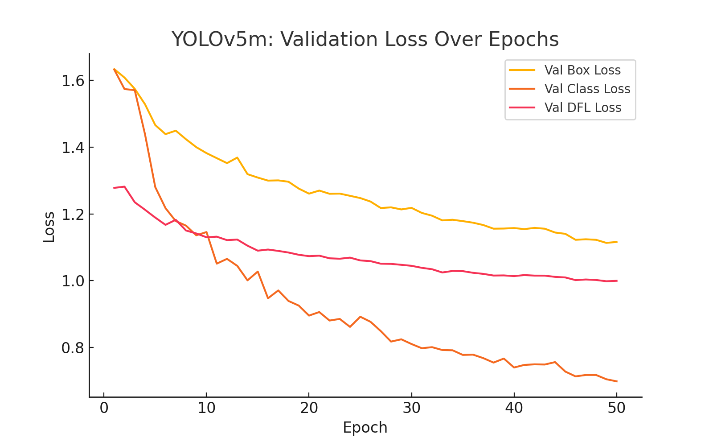 

**Explanation:**
- Validation loss evaluates the model's performance on unseen data.
- Lower validation losses suggest that the model generalizes well.
- The steady reduction in **Box Loss**, **Class Loss**, and **DFL Loss** indicates minimal overfitting, as the losses align closely with the training losses.

---

## Validation Metrics Over Epochs
- **Precision** and **Recall** steadily increase, stabilizing at higher values in later epochs.
- **mAP@0.5** and **mAP@0.5:0.95** demonstrate consistent improvement.

### Validation Metrics Plot
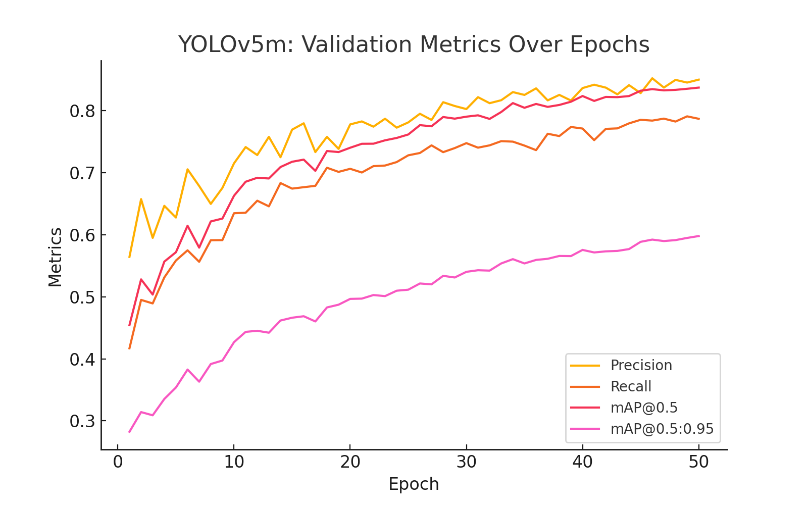 

**Explanation:**
- **Precision**: Measures how many of the predicted objects are correct.
- **Recall**: Measures how many of the ground-truth objects are detected.
- **mAP@0.5**: Mean Average Precision at IoU threshold of 0.5. This measures detection accuracy at a single threshold.
- **mAP@0.5:0.95**: Average precision across multiple IoU thresholds (0.5 to 0.95). This is a stricter and more comprehensive metric.
- The increase in these metrics over epochs reflects that the model improves its accuracy and detection performance.

---

</details>


## YOLOv8n Training Results

<details>
    <summary>📈 Click to see results</summary>

---

## YOLOv8n Final Metrics Summary (Epoch 50)
| Metric             | Value      |
|--------------------|------------|
| **Epoch**          | 50    |
| **Train Box Loss** | 1.15010 |
| **Train Class Loss** | 0.74757 |
| **Train DFL Loss** | 0.97400 |
| **Validation Box Loss** | 1.28800 |
| **Validation Class Loss** | 0.91859 |
| **Validation DFL Loss** | 1.03100 |
| **Precision**      | 0.80710 |
| **Recall**         | 0.71055 |
| **mAP@0.5**        | 0.75985 |
| **mAP@0.5:0.95**   | 0.51454 |

---

## Training Loss Over Epochs
### YOLOv8n Training Loss Plot
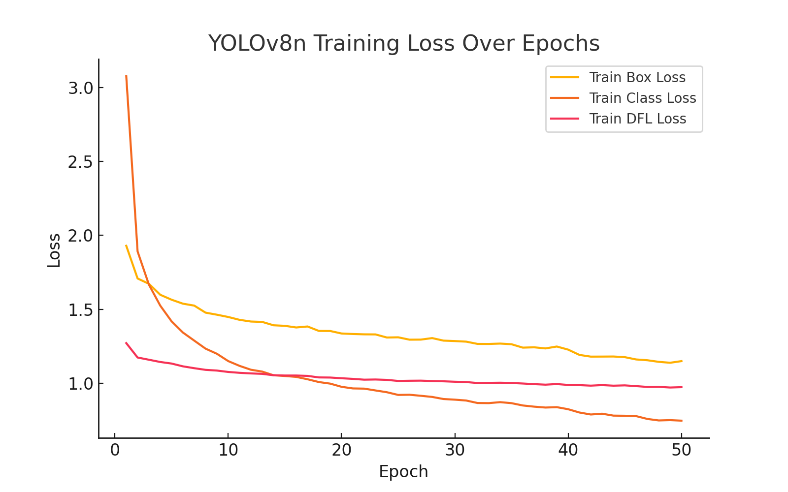  


**Explanation**:
- **Train Box Loss**: Steadily decreases as the model improves in predicting object bounding boxes.
- **Train Class Loss**: The model gradually becomes better at classifying objects.
- **Train DFL Loss**: Confidence in predictions increases as this loss decreases.

---

## Validation Loss Over Epochs
### YOLOv8n Validation Loss Plot
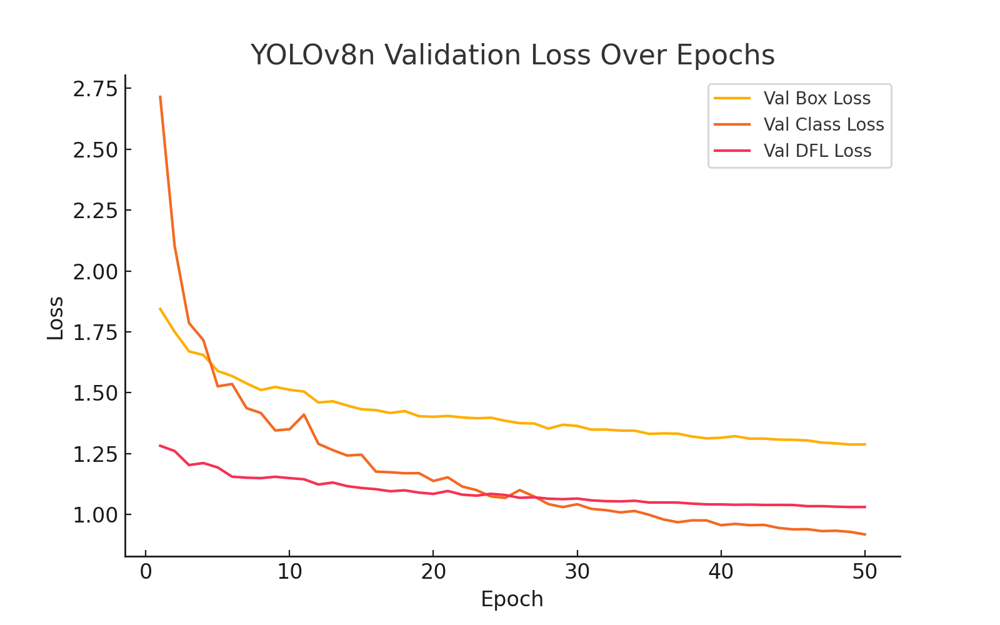  

**Explanation**:
- **Val Box Loss**: Tracks errors in predicting bounding boxes on unseen data.
- **Val Class Loss**: Decreases as classification accuracy improves.
- **Val DFL Loss**: Measures prediction confidence during validation.

**Key Insight**:
- Validation losses decrease and stabilize, showing improved generalization.

---

## Validation Metrics Over Epochs
### YOLOv8n Validation Metrics Plot
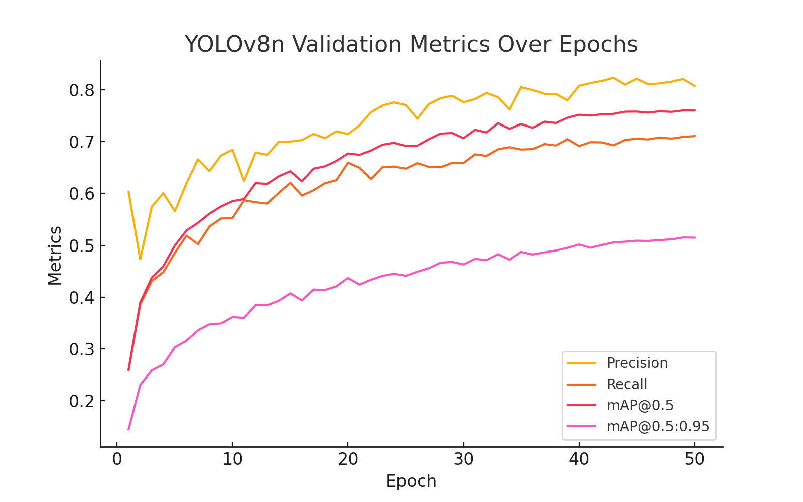  


**Explanation**:
- **Precision**: Indicates fewer false positives in predictions.
- **Recall**: Reflects the model's ability to detect all objects.
- **mAP@0.5**: Accuracy at IoU=0.5 steadily increases, showing improved performance.
- **mAP@0.5:0.95**: Measures robustness at varying IoU thresholds.

**Key Insight**:
- Precision, Recall, and mAP values increase steadily, demonstrating effective learning.

---

</details>

## YOLOv8m Training Results

<details>
    <summary>📈 Click to see results</summary>


---

## YOLOv8m Final Metrics Summary (Epoch 50)
| Metric             | Value      |
|--------------------|------------|
| **Epoch**          | 50    |
| **Train Box Loss** | 0.88608 |
| **Train Class Loss** | 0.48225 |
| **Train DFL Loss** | 0.92013 |
| **Validation Box Loss** | 1.09110 |
| **Validation Class Loss** | 0.66427 |
| **Validation DFL Loss** | 1.01660 |
| **Precision**      | 0.84006 |
| **Recall**         | 0.79242 |
| **mAP@0.5**        | 0.83794 |
| **mAP@0.5:0.95**   | 0.60794 |

---


## Key Observations
1. YOLOv8m shows consistent improvement across all metrics over the epochs.
2. The model achieves stable losses and high mAP scores.

---

### **1. Training Loss Plot**
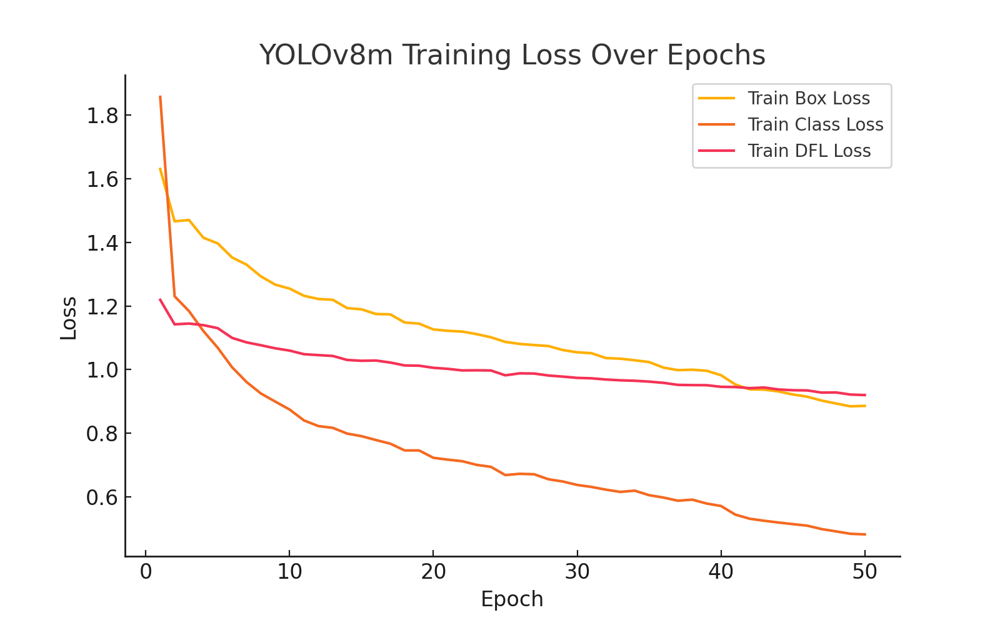

**Explanation**:
- **Train Box Loss**: Loss for bounding box localization steadily decreases, showing the model's improvement in predicting object positions.
- **Train Class Loss**: Classification loss decreases as the model learns to predict classes more accurately.
- **Train DFL Loss**: Confidence in predictions improves as this loss decreases.

**Key Insight**: A consistent downward trend across all losses indicates effective training.

---

### **2. Validation Loss Plot**
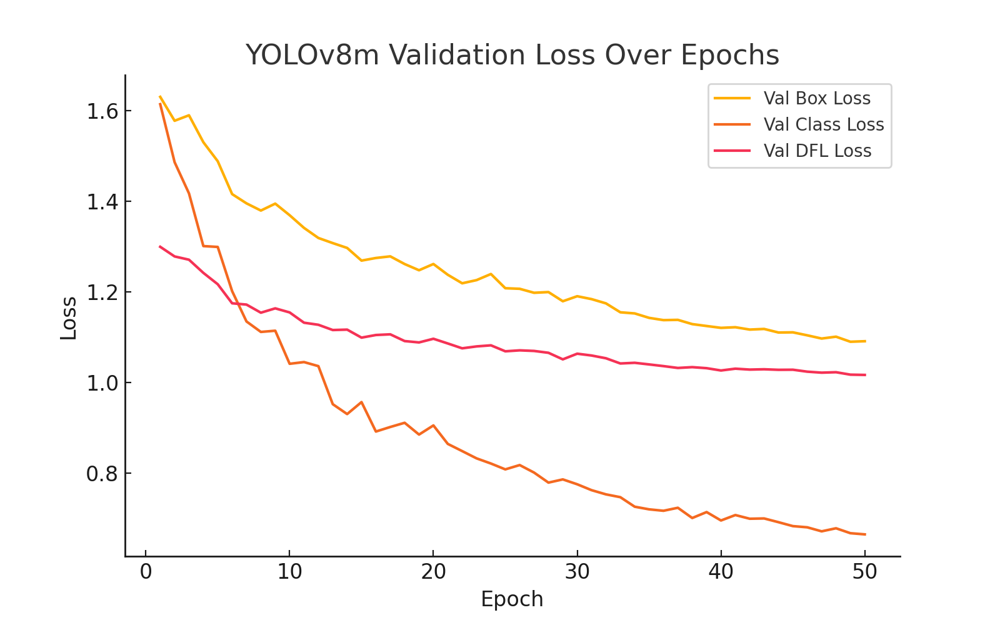


**Explanation**:
- **Val Box Loss**: Measures bounding box prediction errors on unseen validation data.
- **Val Class Loss**: Tracks classification errors during validation.
- **Val DFL Loss**: Indicates confidence in predictions.

**Key Insight**:
- The decreasing and stabilizing validation losses confirm the model's generalization without overfitting.

---

### **3. Validation Metrics Plot**
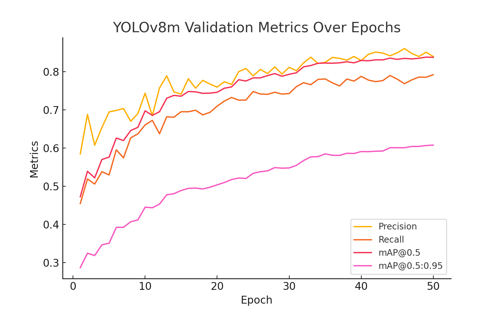

**Explanation**:
- **Precision**: Indicates fewer false positives (high accuracy in predictions).
- **Recall**: Measures the ability to detect all objects (fewer false negatives).
- **mAP@0.5**: High mean Average Precision at IoU=0.5 reflects strong detection accuracy.
- **mAP@0.5:0.95**: Comprehensive metric averaging IoUs from 0.5 to 0.95 shows robustness.

**Key Insight**:
- The increasing Precision, Recall, and mAP values confirm the model's steady improvement and strong performance.

---


</details>

# Model Comparison

---

## **F1-Confidence Curve Comparison**

<details>
    <summary>Click to see YOLOv5N F1 graph</summary>

## YOLOv5n F1 graph
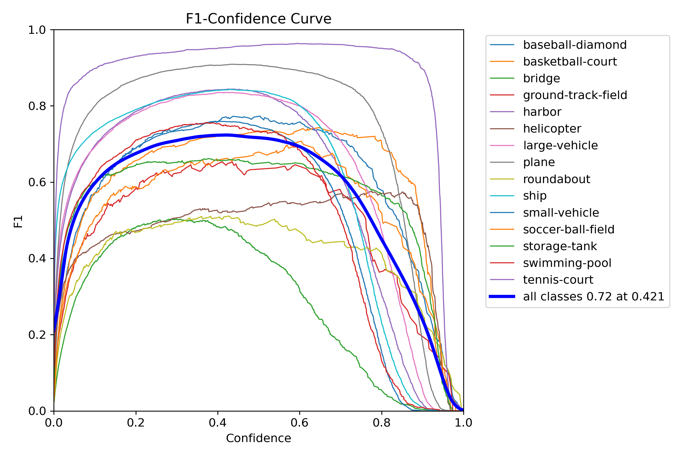

</details>

<details>
    <summary>Click to see YOLOv5M F1 graph</summary>

## YOLOv5m F1 graph
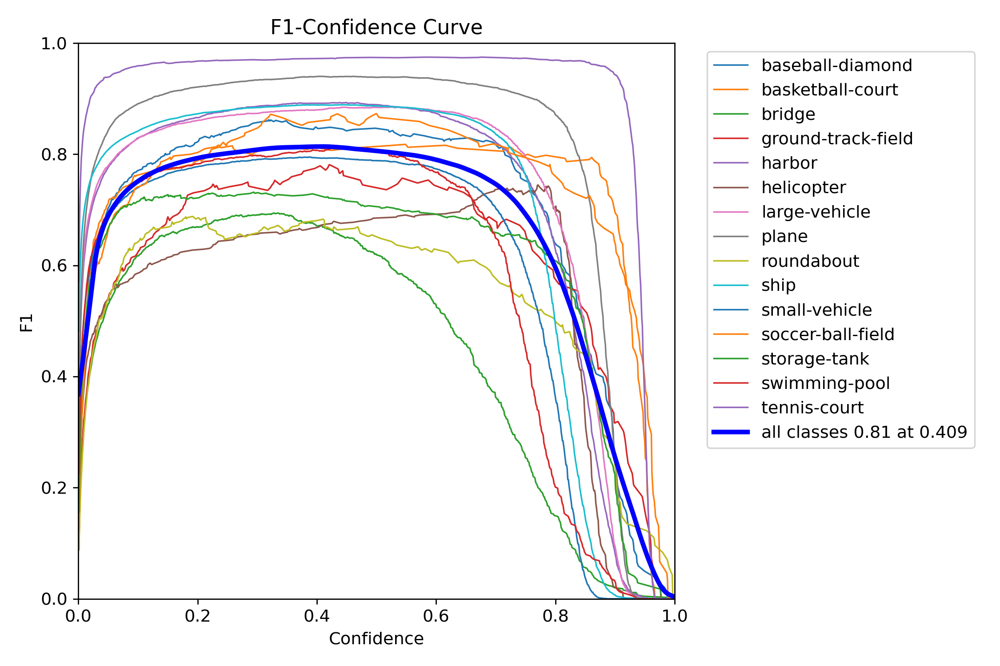

</details>

<details>
    <summary>Click to see YOLOv8N F1 graph</summary>

## YOLOv8n F1 graph
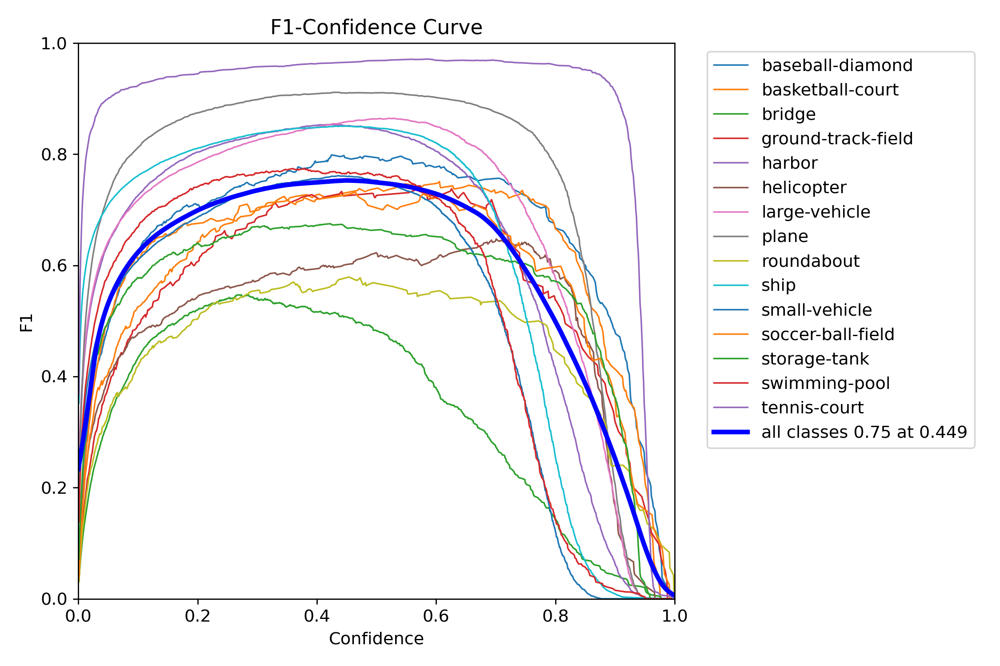

</details>

<details>
    <summary>Click to see YOLOv8M F1 graph</summary>

## YOLOv8m F1 graph
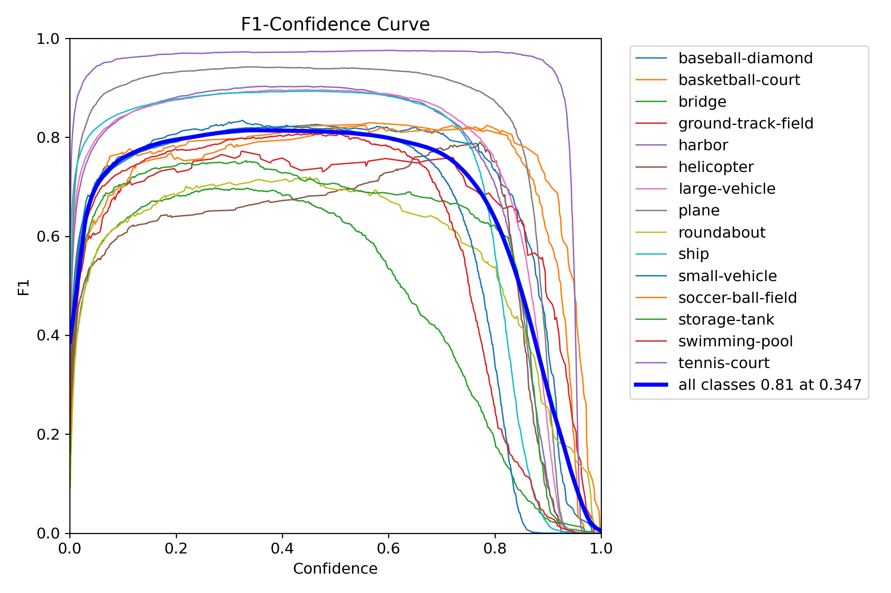

</details>

## **Comparison Summary**

| *Curve*             | *Max F1 Score* | *Confidence Threshold* | *Observation*                                             |
|------------------------|------------------|--------------------------|------------------------------------------------------------|
| *F1_curve_v5m*    | *0.81*         | *0.409*                | Highest F1 score across all classes with confidence ~0.4.  |
| *F1_curve_v5n*    | *0.72*         | *0.421*                | Lower peak F1 score; similar threshold as v5m.            |
| *F1_curve_v8m*    | *0.81*         | *0.347*                | High F1 score achieved but at a lower threshold.           |
| *F1_curve_v8n*    | *0.75*         | *0.449*                | Moderate F1 score; threshold ~0.45 (higher than v8m).      |

---

## **Key Observations**

1. *F1 Score Peaks*:
   - *v5m* and *v8m* achieved the *highest F1 scores* of *0.81*.
   - *v5n* shows the lowest performance with a peak F1 of *0.72*.

2. *Confidence Thresholds*:
   - *v5m* peaks at *0.409*, while *v8m* peaks at a *lower threshold* of *0.347*.
   - *v8n* achieves its best F1 score at a higher confidence threshold of *0.449*.

3. *Overall Trends*:
   - The *v5m* and *v8m* curves exhibit smooth progressions and higher performance overall.
   - The *v5n* and *v8n* curves show a dip in F1 scores, indicating *weaker predictions* compared to their counterparts.

---

## **Conclusion**

- *Best Performing Models*:  
   - *v5m* and *v8m* with peak F1 scores of *0.81*.  

- *Optimal Confidence Threshold*:  
   - Lower thresholds (~*0.347 to 0.409*) maximize F1 scores.  

- *Weaker Performance*:  
   - *v5n* with the lowest peak F1 score (*0.72*).  

---

This summary highlights that *v5m* and *v8m* outperform other curves, and adjusting the confidence threshold plays a significant role in achieving optimal performance.

From the *final epoch metrics* and *F1-confidence curves*:
- *YOLOv8m* emerges as the *best overall model*:
  - Highest *precision* and *recall*.
  - Best F1 score (*0.81) at a low confidence threshold (0.347*).
  - Lower validation losses compared to YOLOv5m, indicating better generalization.
- *YOLOv5m* is a close second:
  - Similar F1 score (*0.81) but at a higher confidence threshold (0.409*).
  - Slightly higher validation losses compared to YOLOv8m.
- *YOLOv8n* outperforms YOLOv5n among the *"nano" models*, achieving better F1 scores and validation metrics.

---

### *Final Conclusion*
- If *performance* is the top priority, *YOLOv8m* is the *best model* overall.
- For *efficiency* and lower computational cost, *YOLOv8n* is the better choice over YOLOv5n. Especially considering the fact that the nano models have considerably less trainable parameters with a much simpler network with less layers.

We will once again re-iterate that the YOLO series of models were originally intended for real time object detection, that being said keep in mind that YOLOv8m is considerably heavier to run at a decent framerate when it comes to real time detection.

**In addtion to this - This conclusion is based purely off metrics and although YOLOv5m comes in as a close second its worthwhile to consider that it has considerably more layers and also uses anchor boxes which YOLOv8m does not need -- hence improving perfomance. In that sense we would conclude that YOLOv8m is an outright winner when it comes to single image processing for the models that we examined.**


# The Fun Part (RUN IT YOURSELF) *only compatible with Windows

We have included an inference tool with a fully functioning easy to use GUI which you can simply select a model and run inference. We recommend you use snipping tool to select a region in satellite mode in google maps.
Take some images and follow the tutorial to get started.

### Prerequisites

Ensure you have **Python 3.8+** installed on your system. You can check your Python version by running:

```bash
python --version
```

```bash
git clone https://github.com/Nikfahama/YOLO-Networks-in-Action
cd <repository-folder>
```  
  

its always recommended to install dependencies in a venv but this is totally optional.

run:  
```bash
pip install -r requirements.txt
```

then simply run:  
```bash
python infer.py
```
The GUI is intuitive and simple to use, simply upload an image, select a model and click "Run Inference". The results are pretty amazing to see. You may also save the image later if you desire.  

That will do it for our final project :)
