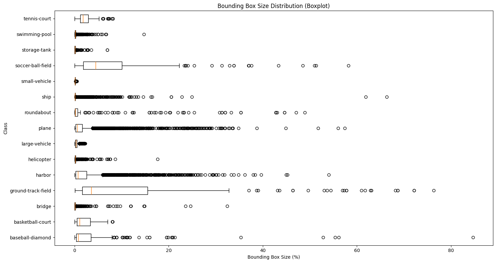

# Applied Statistics Final Project - YOLO Networks in Action

## Introduction and Project Outline

In this project we will be exploring the process of retraining the some of the most popular state of the art computer vision models out there - more specifically, 
multiple samples from the YOLO (You Only Look Once) family of architectures.  
  
The YOLO series relies on several gnerations / implementations of different architectures to achieve object / bounding box detections on classes which they were trained on. YOLO was originally made
for real time applications, however for the scope of our project we will focus strictly on single frame performance and testing. We have included a snippet of output from running inference of a YOLOv8m
model we retrained as to provide an example of what the model is capable of doing. In this specific example the model found one plane with a confidence of 90%.

  
  
### Now for the outline of our project  
In our case specifically we will be retraining 4 variants of YOLO on the same dataset to examine each model's respective performance and characteristics. The motivation for this project
is to exemplify how one might implement these models for their specific needs in the real world - for example an intelligence agency whos job it is to examine satellite photos, which can use YOLO
in order to sweep though a large amount of photos hastily while being able to retrain the model on new targets that they might need to identify (a new type of plane, a dock / harbour or anything else for that matter).  
  
The variants of YOLO that we will be retraining are:  

- YOLOv5n
- YOLOv5m
- YOLOv8n
- YOLOv8m

### What are the differences between these variants?  
  
**As a general rule of thumb** YOLO models come in multiple *sizes* - N, S, M, L, X. The meanings of each can be summarised using the following table:  
  
  | Model        | Size       | Speed         | Accuracy       |
|--------------|------------|---------------|----------------|
| **YOLO-N**   | Very Small | Fastest       | Lowest Accuracy|
| **YOLO-S**   | Small      | Very Fast     | Lower Accuracy |
| **YOLO-M**   | Medium     | Balanced      | Medium Accuracy|
| **YOLO-L**   | Large      | Slower        | High Accuracy  |
| **YOLO-X**   | Extra Large| Slowest       | Highest Accuracy|
  
### There are architectural differences between YOLOv5 and YOLOv8  
The main differences between YOLOv5 and YOLOv8 boil down to the use of a concept called an "anchor box".

**Anchor Box (Simplified Definition)**
  
*An anchor box is a predefined bounding box of specific size and shape placed on a feature map grid cell. It serves as a reference for the model to predict the final object bounding box by adjusting its position, size, and shape.*

| **Aspect**             | **Anchor-Based Detection** (YOLOv5)         | **Anchor-Free Detection** (YOLOv8)          |
|------------------------|-------------------------------------|------------------------------------|
| **Bounding Box**       | Predicted as offsets to predefined anchor boxes. | Directly predicts the bounding box center, size, and coordinates. |
| **Anchors**            | Uses predefined anchor boxes at each grid cell. | Does not use anchor boxes.         |
| **Scalability**        | Requires manually tuning anchor sizes and aspect ratios. | Simpler and less manual design.    |
| **Computation**        | Slightly more complex due to anchor generation. | Faster and more efficient.         |
| **Flexibility**        | Works well for objects of different scales/aspect ratios. | Better for detecting small and irregular objects. |

## Below is a summary of the architectures of the YOLO variants we selected to examine:  

### YOLOv5n

    
 🏗️ Click to view model architecture

| **Index** | **From** | **#** | **Params** | **Module**                              | **Arguments**                  |
|-----------|----------|-------|------------|----------------------------------------|--------------------------------|
| 0         | -1       | 1     | 1,760      | ultralytics.nn.modules.conv.Conv       | [3, 16, 6, 2, 2]               |
| 1         | -1       | 1     | 4,672      | ultralytics.nn.modules.conv.Conv       | [16, 32, 3, 2]                 |
| 2         | -1       | 1     | 4,800      | ultralytics.nn.modules.block.C3        | [32, 32, 1]                    |
| 3         | -1       | 1     | 18,560     | ultralytics.nn.modules.conv.Conv       | [32, 64, 3, 2]                 |
| 4         | -1       | 2     | 29,184     | ultralytics.nn.modules.block.C3        | [64, 64, 2]                    |
| 5         | -1       | 1     | 73,984     | ultralytics.nn.modules.conv.Conv       | [64, 128, 3, 2]                |
| 6         | -1       | 3     | 156,928    | ultralytics.nn.modules.block.C3        | [128, 128, 3]                  |
| 7         | -1       | 1     | 295,424    | ultralytics.nn.modules.conv.Conv       | [128, 256, 3, 2]               |
| 8         | -1       | 1     | 296,448    | ultralytics.nn.modules.block.C3        | [256, 256, 1]                  |
| 9         | -1       | 1     | 164,608    | ultralytics.nn.modules.block.SPPF      | [256, 256, 5]                  |
| 10        | -1       | 1     | 33,024     | ultralytics.nn.modules.conv.Conv       | [256, 128, 1, 1]               |
| 11        | -1       | 1     | 0          | torch.nn.modules.upsampling.Upsample   | [None, 2, 'nearest']           |
| 12        | [-1, 6]  | 1     | 0          | ultralytics.nn.modules.conv.Concat     | [1]                            |
| 13        | -1       | 1     | 90,880     | ultralytics.nn.modules.block.C3        | [256, 128, 1, False]           |
| 14        | -1       | 1     | 8,320      | ultralytics.nn.modules.conv.Conv       | [128, 64, 1, 1]                |
| 15        | -1       | 1     | 0          | torch.nn.modules.upsampling.Upsample   | [None, 2, 'nearest']           |
| 16        | [-1, 4]  | 1     | 0          | ultralytics.nn.modules.conv.Concat     | [1]                            |
| 17        | -1       | 1     | 22,912     | ultralytics.nn.modules.block.C3        | [128, 64, 1, False]            |
| 18        | -1       | 1     | 36,992     | ultralytics.nn.modules.conv.Conv       | [64, 64, 3, 2]                 |
| 19        | [-1, 14] | 1     | 0          | ultralytics.nn.modules.conv.Concat     | [1]                            |
| 20        | -1       | 1     | 74,496     | ultralytics.nn.modules.block.C3        | [128, 128, 1, False]           |
| 21        | -1       | 1     | 147,712    | ultralytics.nn.modules.conv.Conv       | [128, 128, 3, 2]               |
| 22        | [-1, 10] | 1     | 0          | ultralytics.nn.modules.conv.Concat     | [1]                            |
| 23        | -1       | 1     | 296,448    | ultralytics.nn.modules.block.C3        | [256, 256, 1, False]           |
| 24        | [17, 20, 23] | 1 | 754,237    | ultralytics.nn.modules.head.Detect     | [15, [64, 128, 256]]           |

### Key Points:

- **Total Layers**: 262  
- **Total Trainable Parameters**: 2.51M  

### YOLOv5m

    
 🏗️ Click to view model architecture

| **Index** | **From**         | **n** | **Params**  | **Module**                                  | **Arguments**                      |
|-----------|------------------|-------|-------------|--------------------------------------------|-----------------------------------|
| 0         | -1               | 1     | 5280        | ultralytics.nn.modules.conv.Conv            | [3, 48, 6, 2, 2]                  |
| 1         | -1               | 1     | 41664       | ultralytics.nn.modules.conv.Conv            | [48, 96, 3, 2]                    |
| 2         | -1               | 2     | 65280       | ultralytics.nn.modules.block.C3             | [96, 96, 2]                       |
| 3         | -1               | 1     | 166272      | ultralytics.nn.modules.conv.Conv            | [96, 192, 3, 2]                   |
| 4         | -1               | 4     | 444672      | ultralytics.nn.modules.block.C3             | [192, 192, 4]                     |
| 5         | -1               | 1     | 664320      | ultralytics.nn.modules.conv.Conv            | [192, 384, 3, 2]                  |
| 6         | -1               | 6     | 2512896     | ultralytics.nn.modules.block.C3             | [384, 384, 6]                     |
| 7         | -1               | 1     | 2655744     | ultralytics.nn.modules.conv.Conv            | [384, 768, 3, 2]                  |
| 8         | -1               | 2     | 4134912     | ultralytics.nn.modules.block.C3             | [768, 768, 2]                     |
| 9         | -1               | 1     | 1476864     | ultralytics.nn.modules.block.SPPF           | [768, 768, 5]                     |
| 10        | -1               | 1     | 295680      | ultralytics.nn.modules.conv.Conv            | [768, 384, 1, 1]                  |
| 11        | -1               | 1     | 0           | torch.nn.modules.upsampling.Upsample        | [None, 2, 'nearest']              |
| 12        | [-1, 6]          | 1     | 0           | ultralytics.nn.modules.conv.Concat          | [1]                               |
| 13        | -1               | 2     | 1182720     | ultralytics.nn.modules.block.C3             | [768, 384, 2, False]              |
| 14        | -1               | 1     | 74112       | ultralytics.nn.modules.conv.Conv            | [384, 192, 1, 1]                  |
| 15        | -1               | 1     | 0           | torch.nn.modules.upsampling.Upsample        | [None, 2, 'nearest']              |
| 16        | [-1, 4]          | 1     | 0           | ultralytics.nn.modules.conv.Concat          | [1]                               |
| 17        | -1               | 2     | 296448      | ultralytics.nn.modules.block.C3             | [384, 192, 2, False]              |
| 18        | -1               | 1     | 332160      | ultralytics.nn.modules.conv.Conv            | [192, 192, 3, 2]                  |
| 19        | [-1, 14]         | 1     | 0           | ultralytics.nn.modules.conv.Concat          | [1]                               |
| 20        | -1               | 2     | 1035264     | ultralytics.nn.modules.block.C3             | [384, 384, 2, False]              |
| 21        | -1               | 1     | 1327872     | ultralytics.nn.modules.conv.Conv            | [384, 384, 3, 2]                  |
| 22        | [-1, 10]         | 1     | 0           | ultralytics.nn.modules.conv.Concat          | [1]                               |
| 23        | -1               | 2     | 4134912     | ultralytics.nn.modules.block.C3             | [768, 768, 2, False]              |
| 24        | [17, 20, 23]     | 1     | 4226749     | ultralytics.nn.modules.head.Detect          | [15, [192, 384, 768]]             |

### Key Points:

- **Total Layers**: 339  
- **Total Trainable Parameters**: 25.07M  

  

### YOLOv8n

    
 🏗️ Click to view model architecture

    
| **Index** | **From**    | **N** | **Parameters** | **Module**                                     | **Arguments**              |
|-----------|-------------|-------|----------------|-----------------------------------------------|----------------------------|
| 0         | -1          | 1     | 464            | ultralytics.nn.modules.conv.Conv               | [3, 16, 3, 2]              |
| 1         | -1          | 1     | 4672           | ultralytics.nn.modules.conv.Conv               | [16, 32, 3, 2]             |
| 2         | -1          | 1     | 7360           | ultralytics.nn.modules.block.C2f               | [32, 32, 1, True]          |
| 3         | -1          | 1     | 18560          | ultralytics.nn.modules.conv.Conv               | [32, 64, 3, 2]             |
| 4         | -1          | 2     | 49664          | ultralytics.nn.modules.block.C2f               | [64, 64, 2, True]          |
| 5         | -1          | 1     | 73984          | ultralytics.nn.modules.conv.Conv               | [64, 128, 3, 2]            |
| 6         | -1          | 2     | 197632         | ultralytics.nn.modules.block.C2f               | [128, 128, 2, True]        |
| 7         | -1          | 1     | 295424         | ultralytics.nn.modules.conv.Conv               | [128, 256, 3, 2]           |
| 8         | -1          | 1     | 460288         | ultralytics.nn.modules.block.C2f               | [256, 256, 1, True]        |
| 9         | -1          | 1     | 164608         | ultralytics.nn.modules.block.SPPF              | [256, 256, 5]              |
| 10        | -1          | 1     | 0              | torch.nn.modules.upsampling.Upsample           | [None, 2, 'nearest']       |
| 11        | [-1, 6]     | 1     | 0              | ultralytics.nn.modules.conv.Concat             | [1]                        |
| 12        | -1          | 1     | 148224         | ultralytics.nn.modules.block.C2f               | [384, 128, 1]              |
| 13        | -1          | 1     | 0              | torch.nn.modules.upsampling.Upsample           | [None, 2, 'nearest']       |
| 14        | [-1, 4]     | 1     | 0              | ultralytics.nn.modules.conv.Concat             | [1]                        |
| 15        | -1          | 1     | 37248          | ultralytics.nn.modules.block.C2f               | [192, 64, 1]               |
| 16        | -1          | 1     | 36992          | ultralytics.nn.modules.conv.Conv               | [64, 64, 3, 2]             |
| 17        | [-1, 12]    | 1     | 0              | ultralytics.nn.modules.conv.Concat             | [1]                        |
| 18        | -1          | 1     | 123648         | ultralytics.nn.modules.block.C2f               | [192, 128, 1]              |
| 19        | -1          | 1     | 147712         | ultralytics.nn.modules.conv.Conv               | [128, 128, 3, 2]           |
| 20        | [-1, 9]     | 1     | 0              | ultralytics.nn.modules.conv.Concat             | [1]                        |
| 21        | -1          | 1     | 493056         | ultralytics.nn.modules.block.C2f               | [384, 256, 1]              |
| 22        | [15, 18, 21]| 1     | 754237         | ultralytics.nn.modules.head.Detect             | [15, [64, 128, 256]]       |

### Key Points:

- **Total Layers:** 225  
- **Total Trainable Parameters:** 3.01M  
 

### YOLOv8m

    
 🏗️ Click to view model architecture

| **Index** | **From** | **Number** | **Parameters** | **Module**                                              | **Arguments**                          |
|-----------|----------|------------|----------------|--------------------------------------------------------|----------------------------------------|
| 0         | -1       | 1          | 1392           | `ultralytics.nn.modules.conv.Conv`                     | [3, 48, 3, 2]                          |
| 1         | -1       | 1          | 41664          | `ultralytics.nn.modules.conv.Conv`                     | [48, 96, 3, 2]                         |
| 2         | -1       | 2          | 111360         | `ultralytics.nn.modules.block.C2f`                     | [96, 96, 2, True]                      |
| 3         | -1       | 1          | 166272         | `ultralytics.nn.modules.conv.Conv`                     | [96, 192, 3, 2]                        |
| 4         | -1       | 4          | 813312         | `ultralytics.nn.modules.block.C2f`                     | [192, 192, 4, True]                    |
| 5         | -1       | 1          | 664320         | `ultralytics.nn.modules.conv.Conv`                     | [192, 384, 3, 2]                       |
| 6         | -1       | 4          | 3248640        | `ultralytics.nn.modules.block.C2f`                     | [384, 384, 4, True]                    |
| 7         | -1       | 1          | 1991808        | `ultralytics.nn.modules.conv.Conv`                     | [384, 576, 3, 2]                       |
| 8         | -1       | 2          | 3985920        | `ultralytics.nn.modules.block.C2f`                     | [576, 576, 2, True]                    |
| 9         | -1       | 1          | 831168         | `ultralytics.nn.modules.block.SPPF`                    | [576, 576, 5]                          |
| 10        | -1       | 1          | 0              | `torch.nn.modules.upsampling.Upsample`                 | [None, 2, 'nearest']                   |
| 11        | [-1, 6]  | 1          | 0              | `ultralytics.nn.modules.conv.Concat`                   | [1]                                    |
| 12        | -1       | 2          | 1993728        | `ultralytics.nn.modules.block.C2f`                     | [960, 384, 2]                          |
| 13        | -1       | 1          | 0              | `torch.nn.modules.upsampling.Upsample`                 | [None, 2, 'nearest']                   |
| 14        | [-1, 4]  | 1          | 0              | `ultralytics.nn.modules.conv.Concat`                   | [1]                                    |
| 15        | -1       | 2          | 517632         | `ultralytics.nn.modules.block.C2f`                     | [576, 192, 2]                          |
| 16        | -1       | 1          | 332160         | `ultralytics.nn.modules.conv.Conv`                     | [192, 192, 3, 2]                       |
| 17        | [-1, 12] | 1          | 0              | `ultralytics.nn.modules.conv.Concat`                   | [1]                                    |
| 18        | -1       | 2          | 1846272        | `ultralytics.nn.modules.block.C2f`                     | [576, 384, 2]                          |
| 19        | -1       | 1          | 1327872        | `ultralytics.nn.modules.conv.Conv`                     | [384, 384, 3, 2]                       |
| 20        | [-1, 9]  | 1          | 0              | `ultralytics.nn.modules.conv.Concat`                   | [1]                                    |
| 21        | -1       | 2          | 4207104        | `ultralytics.nn.modules.block.C2f`                     | [960, 576, 2]                          |
| 22        | [15, 18, 21] | 1       | 3784381        | `ultralytics.nn.modules.head.Detect`                   | [15, [192, 384, 576]]                  |

### Key Points:

- **Total Layers**: 295  
- **Total Trainable Parameters**: 25.9M  
 

  
  
From the architectural & technical summaries above we can see that there are major differences between the genereations and variants of the models. As such we decided to take samples
from two of the most popular gnerations of YOLO (v5 and v8) as well as two of the lighter variants (N and M) while placing an emphasis that we take at least some spacing between the variants
as to avoid sampling ones which might be too close to see dramatic results (such as N and S).

We would also like to re-iterate that we were working under time and hardware constraints. Specifically when it comes to hardware all of the training that took place was done with a 
Laptop RTX-4070 with 8GB of VRAM.

## Data Preparation
  

To retrain our selected YOLO models we made use of the klk dataset which we found on roboflow.  
The dataset can be found [here](https://universe.roboflow.com/kemal/klk-pwt7h).  
As a summary the dataset structure looks like:  

- Dataset
    - train
        - images
        - labels
    - valid
        - images
        - labels
    - data.yaml  

  
Where the iamges / labels pairs are simply an image with coordinates to a bounding box and a respective class of object within that bounding box.  
The classes that are included in the dataset (we decided to train on all 15 of them) are:  

- baseball-diamond
- basketball-court
- bridge
- ground-track-field
- harbor
- helicopter
- large-vehicle
- plane
- roundabout
- ship
- small-vehicle
- soccer-ball-field
- storage-tank
- swimming-pool
- tennis-court  

# Dataset Metrics - Training 70% / Validation 30%  
  
Data preparation and metrics notebook can be found [here](data_prep_and_statistics.ipynb).

## Training (4693 images)

    
 📊 Click to view graphs

### Label distribution (Train) - Frequency of each label
  

### Class frequency (Train) - Amount of images that display 
  

### Class co-occurence (Train)
  

### Bounding Box size Distribution (Train)
  

## Validation (2011)

    
 📊 Click to view graphs

### Label distribution (Validation) - Frequency of each label
  

### Class frequency (Validation) - Amount of images that display 
  

### Class co-occurence (Validation)
  

